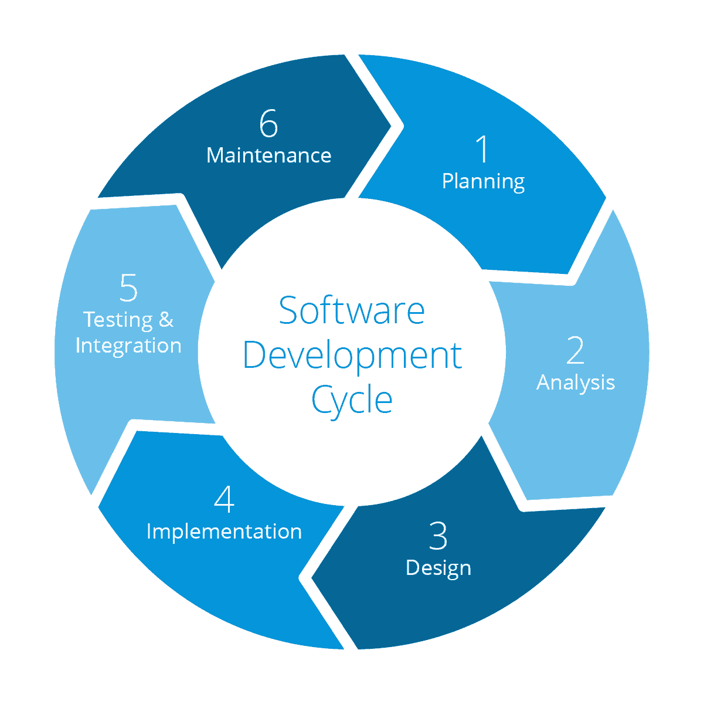

## ¡FELIZ DÍA DEL PROGRAMADOR!
 
Hoy desde Dapda nos gustaría felicitar el día a todos los programadores/desarrolladores, y qué mejor forma que escribir algo sobre desarrollo y de la importancia de lo que supone un buen desarrollo. 
 
### Pero primero...¿Por qué hoy?
 
Este día fue porpuesto en 2002 por Valentin Balt, diseñador web en Parallel Technologies. Este compañero ruso propuso ante el Ministerio de Comunicaciones que oficializara el 13 de septiembre, o 12 si es bisiesto, como el "Día del programador". La fecha fue elegida por dos motivos principalmente, es el día 256 del año, número máximo que se puede representar con 8 bits. También es la mayor potencia de 2 menor que 365, días que tiene un año.
 
En 2019 se creó un borrador para incluir la nueva festividad y en este mismo año se hizo oficial como festividad en Rusia.
 
### La importancia de un buen desarrollo
 
Hoy en día realizar un buen desarrollo de software es muy importante ya que la competencia en este sector es feroz, todos los días salen nuevos competidores, pequeñas empresas que con menos recursos pueden llegar a superarte. Por lo que un desarrollo como "los de antes" no es suficiente. 
 
En Dapda le damos la importancia necesaria a cada una de las fases del ciclo de vida del proyecto, y en cada una de esas fases tenemos un gran equipo centrado en desarrollar cada fase. 
 
Pensar que un producto sin un proceso donde se definan los requerimientos, o saltarse la fase de pruebas... 
 
FRACASO ASEGURADO Y EN CUALQUIER MOMENTO...
 

 
Esta imagen podría definir por qué fases debería pasar un producto para que no suceda lo que nuestro amigo Denzel está prediciendo.
 

 
Realmente todo esto empieza con una idea y un estudio de mercado, pero eso lo vamos a dejar para otros compañeros. Vamos a suponer que esa fase la hemos pasado y que vamos a comenzar con nuestro proyecto. 
 
Una planificación y una definición de requisitos te puede ahorrar muchos quebraderos de cabeza, mejor no escatimar en este punto, es el primero y uno de los más importantes. Para este paso, opinión personal, un perfil técnico puede darle un gran valor y una mejor visión a los requisitos, cosa que agradeceremos los desarrolladores.
 
En la fase del diseño, otra de las fases más importantes que servirán para definir la arquitectura y tecnologías que se utilizaran, pararse en este punto podría suponer un gran abaratamiento de gastos.
 
No siempre elegir lo último en tecnología es una buena estrategia. Por unos lados es una gran ventaja ya que tu equipo técnico está en continua evolución y reciclandose, pero por otros lados puedes encontrarte con muchos problemas que te harán perder tiempo lo que se traduce en dinero en el mundo empresarial.
 
En Dapda, siempre intentamos estar a la última, pero con un buen análisis y diseño sobre lo que queremos hacer. Nunca nos hemos aventurado en proyectos con tecnologías en sus primeras fases, ya que esto puede repercutir negativamente en todos, empresa y en el cliente.
 
La fase de la implementación quizás sea en la que más disfrutamos, es cuando nosotros creamos y peleamos para que todo lo que se ha planificado y diseñado salga adelante. En la imagen del ciclo de vida, el paso 5, la parte de testing, también la incluimos en la implementación.
 
Es más, le damos mucha importancia a la calidad del código y asegurar esta calidad no es tarea fácil, por eso seguimos en constante formación aunque la principal manera con la que se puede conseguir esa calidad es con una gran batería de test. Creo que es algo compartido entre todos los desarrolladores, que un código sin su test... mal asunto. 
 
Ya que en Dapda se le da importancia a este aspecto, todo el equipo IT, fué formado en TDD con el equipo de Codium. Una semana entera en la que se buscó mejorar el equipo para ofrecer lo mejor de sí mismo y dar la calidad que nuestros clientes se merecen.
 
Siempre hemos querido aportar valor a nuestros clientes ofreciendo entregas continuas, pasando antes por el equipo de QA, que verifica que los requisitos de cada entrega son los planificados y que todo va como la seda.
 
Una vez realizada la entrega este proceso se podría decir que se repite por cada nueva feature nueva que implementamos en nuestros productos. 

